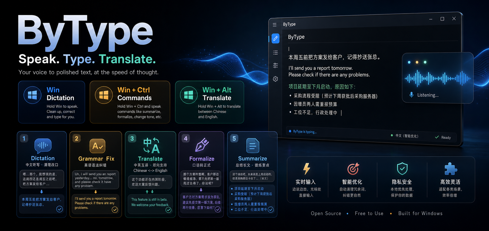

# ByType

按住热键说话,松手即把文字注入当前应用的 Windows 语音输入工具(Typeless 风格)。
本地 SenseVoice 识别 + LLM 整理,中英文皆可。




## 功能

- **按住说话,识别整理**:按住 `左 Win` 说话,松手 → 本地 SenseVoice 识别 → LLM 去语气词 / 顺句 → 粘贴到当前焦点处
- **翻译**:`左 Win + 左 Alt` 中英互译——说中文出英文,说英文(或其他语言)出中文,并自动纠正语法
- **语音命令 / 总结**:`左 Win + 左 Ctrl`——选中文字时对其执行语音指令(如"翻译成英文""改简洁");未选中时把口述内容去语气词、纠错后**总结**输出
- **会议纪要**:托盘一键开始 / 结束录音,可选「麦克风 + 系统声音 / 仅系统 / 仅麦克风」三种范围;结束后自动分段转写、区分对方多位说话人、用 LLM 整理成结构化纪要;录音合并存档为 MP3。会议纪要页可查看 / 复制 / 重新生成 / 打开文件夹 / 删除
- **录音浮窗**:屏幕底部药丸计时,点它或按 `Esc` 取消(跳过 LLM)
- **提示音**:开始 / 结束轻提示音(可关)
- **设置界面**:热键、LLM、自定义词库、随应用风格、外观(含暗黑模式)、开机自启
- **首次运行向导**:依赖检测 + 模型在线下载 / 本地导入

## 安装(普通用户)

1. 下载 `ByType_x.y.z_x64-setup.exe`(发布后在 GitHub Releases 提供)并运行——当前用户安装,免管理员。
   - 未签名,首次运行 Windows SmartScreen 可能提示"未知发布者":点 **更多信息 → 仍要运行**。
2. 首次启动弹出向导:依赖检测 → 填写 LLM(可跳过)→ 下载或导入语音模型 → 完成。
3. 之后常驻系统托盘,按住热键即可使用。

语音识别模型 SenseVoice(约 228MB)不随安装包分发,由向导在线下载(默认 HuggingFace 镜像 hf-mirror,可改源)或本地导入。会议用的小模型(VAD + 说话人分离,共约 33MB)已内置在安装包中,装完即用。

### 文件位置(当前用户安装)

| 内容 | 路径 |
|------|------|
| 程序 | `%LOCALAPPDATA%\ByType\` |
| 配置 | `%LOCALAPPDATA%\ByType\config.toml` |
| 模型 | `%LOCALAPPDATA%\ByType\models\`(SenseVoice + 会议小模型) |
| 会议录音 / 纪要 | `文档\ByType\会议\<时间戳>\`(默认;可在 `[meeting] output_dir` 改) |

> 会议默认存到「文档」便于查找;若你的「文档」在 OneDrive 下,录音会被同步上云——想留本地可把 `[meeting] output_dir` 设为非同步路径(如 `C:/Users/你/ByType/会议`)。

## 配置

LLM 整理走 OpenAI 兼容接口(可用中转站)。在设置界面填写,或编辑 `config.toml`(模板见
[`config.example.toml`](config.example.toml),把 `[llm] api_key` 换成你自己的 key)。
不填 LLM 也能用——直接输出原始识别文本。

## 从源码构建(开发者)

**前置**:

- Rust(MSVC 工具链)
- LLVM / Clang(`sherpa-rs` 经 bindgen 需 libclang)
- Node.js
- 语音模型放到 `models/sensevoice/{model.onnx, tokens.txt}`(int8)

**环境变量**(PowerShell;cargo / libclang 可能不在 PATH):

```powershell
$env:Path = "$env:USERPROFILE\.cargo\bin;C:\Program Files\LLVM\bin;$env:Path"
$env:LIBCLANG_PATH = "C:\Program Files\LLVM\bin"
```

**开发运行 / 测试**:

```powershell
npm install
npm run tauri dev              # GUI 开发
cargo test -p voice-input      # 核心单元测试
```

**打发布安装包**(产出 `target/release/bundle/nsis/ByType_*_x64-setup.exe`):

```powershell
powershell -ExecutionPolicy Bypass -File scripts/build-installer.ps1
```

## 技术栈

Rust + [Tauri 2](https://tauri.app) + React / TypeScript / Tailwind;语音识别用
[sherpa-onnx](https://github.com/k2-fsa/sherpa-onnx) 跑
[SenseVoice](https://github.com/FunAudioLLM/SenseVoice);会议转写另用 Silero VAD 分段、
pyannote 分割 + 3D-Speaker 声纹做说话人分离(均经 sherpa-onnx,纯本地 CPU)。
听写音频采集 cpal、会议系统声音走 WASAPI 环回、存档 MP3 用 LAME;注入走剪贴板 + 模拟 Ctrl+V。

## 隐私

语音识别与说话人分离**完全本地**(CPU,不上传音频)。仅识别后的**文本**会发送到你配置的 LLM 接口做整理 / 翻译 / 纪要;不配置 LLM 则全程本地。会议录音(MP3)只存在本地你指定的目录(注意:若放在 OneDrive 同步的「文档」下会被云同步)。

## 许可证

[MIT](LICENSE) © 2026 Yong Zhang。第三方开源组件致谢见应用内「设置 → 关于」页。
